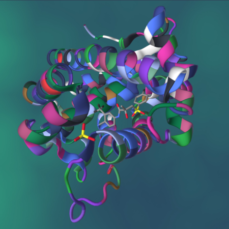
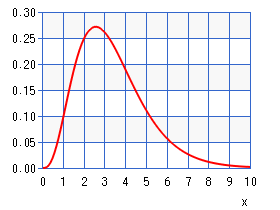

# Drug design simulation

This is a very rough simulation of a program to compute how well a set of short protein *ligands* (each a possible drug) matches a given longer protein string. In the real software programs that do this, the matching is quite sophisticated, targeting possible 'receptor' sites on the protein.

Here is an image from [Wikipedia](https://en.wikipedia.org/wiki/Protein%E2%80%93ligand_complex) illustrating the concept of the ligand (represented by small sticks in center) binding to areas of the protein (represented by ribbon structure):



For the real versions of this code and our simulated case, the longer the ligand or the longer the protein, the longer it takes for the matching and score of the match to complete.

We have created a default fake protein in the code. This can be changed on the command line.

We create the list of possible ligands in 2 ways:

1. If the number of ligands is <= 18, the list of ligands comes from a fabricated list that is hard-codes in the code. We designed this as an example with a range of ligands whose length was from 2 through 6.

2. If the number of ligands is > 18, the ligands are generated randomly using a gamma distribution that looks like this:



This means that we will have more ligands of length 2 or 3 and fewer of 4, 5, and 6, which are each declining in number. This has no relation to the real problem, but instead gives us some ligands that can be computed in a reasonable amount of time on a small cluster of single board computers.  This way you can try some experiments and be able to see the advantage of one implementation over the other.

The image of the above Gamma distribution of lengths of ligands came from: [here](https://keisan.casio.com/exec/system/1180573216), where we used a = 4.2 an b = 0.8.


## The two message-passing versions

Each of these versions uses these patterns from the mpi4py patternlets:

- SPMD, Single program, multiple data
- master-worker
- message passing

The difference between the versions is as follows:

1. `dd_mpi_equal_chunks.py` : The master divides the ligands from the list equally among each worker process, sending all the work at once and waiting for results from each worker. This uses the *parallel loop equal chunks* pattern.

2. `dd_mpi_dynamic.py` : The master sends ligands one at a time to each worker, giving them new work once they have completed another one. This uses the *dynamic load balance* pattern.

Please study the code to see how each one works.

## Running Experiments

The python code is designed to be used with mpi4py. You will need this installed on your own machine or on a cluster of machines.

What you can try will depend on the speed of your system. A simple place to start is with our fixed set of 18 ligands.

## Cluster of machines method

**DO** use this method on a Raspberry Pi cluster.

You will want to run each version on a cluster like this:

1. mpirun -np 4 -hostfile cluster_nodes --map-by node python dd_mpi_equal_chunks.py 18 --verbose

2. mpirun -np 4 -hostfile cluster_nodes --map-by node python dd_mpi_dynamic.py 18 --verbose

This will vary between openMPI and MPICH versions of MPI. What is shown is for openMPI.

From here you should be able to trace how the two programs are working.

You can get all the options like this:

1. python dd_mpi_equal_chunks.py --help
2. python ./dd_mpi_dynamic.py --help

## Experiments to run: observe differences and performance improvement

### Difference between equal loads and dynamic loads

The first point to notice about this example is that the work of each worker varies, so the time to compute a score for a ligand varies. This means we can experiment to see how assigning equal amounts of ligands per worker compares to dynamically assigning each ligand to the next worker that has finished.

Run each of the following cases as you did above, but changing the number of ligands. Start like this, where the 12 is for 12 ligands:

```
mpirun -np 4 -hostfile cluster_nodes --map-by node python dd_mpi_equal_chunks.py 12 --verbose
```

```
mpirun -np 4 -hostfile cluster_nodes --map-by node python dd_mpi_dynamic.py 12 --verbose
```


Fill in the following table, where you run these again, changing the 12 to 18, then 24, then 30.

| -np | #ligands | equal chunks time | dynamic time |
|-----|----------|-------------------|--------------|
| 4   | 12       |                   |              |
| 4   | 18       |                   |              |
| 4   | 24       |                   |              |
| 4   | 30       |                   |              |


What do you observe about the difference between the two versions?

It is important to realize that these results might not always follow this pattern, depending on the number of ligands you try. It can happen that over a larger amount of overall work, the 'equal chunks' version works just as well as the dynamic version. (With more work, on average, the equal versions work out; with a really small amount of work per process this can also happen.)

### Observing Scalability

Scalability is an important measure of parallel programs. To observe scalability, you can try either program with a fixed number of ligands, varying the number of processes like this: 2 (1 worker), 3 (2 workers), 5 (4 workers), 9 (8 workers).

| -np | #ligands | # workers | equal chunks time | dynamic time |
|-----|----------|-----------|-------------------|--------------|
| 2   | 21       |     1     |                   |              |
| 3   | 21       |     2     |                   |              |
| 5   | 21       |     4     |                   |              |
| 9   | 21       |     8     |                   |              |

What do you observe about the time as you double the number of workers?

Ideally, as you double the number of workers, the time should be cut in half. This is called **strong scalability**. But there is some overhead from the message passing, so we don't see perfect strong scalability.

Can you explain the difference between each version, especially as the number of workers increases?

You could also try a smaller number of ligands and observe when it is no longer beneficial to use any more workers in either of these cases. Try filling in this table:

| -np | #ligands | # workers | equal chunks time | dynamic time |
|-----|----------|-----------|-------------------|--------------|
| 2   | 18       |     1     |                   |              |
| 3   | 18       |     2     |                   |              |
| 5   | 18       |     4     |                   |              |
| 9   | 18       |     8     |                   |              |
| 17  | 18       |     16    |                   |              |

What observations can you make now?

# Other information

What follows is some additional information and a possible improvement to the code that you could explore.

## Simple single machine method

Do **NOT** use this on a Raspberry Pi cluster!!

When trying things out on a laptop, you can run the code this way:

1. mpirun -np 4 python dd_mpi_equal_chunks.py 18 --verbose

2. mpirun -np 4 python dd_mpi_dynamic.py 18 --verbose

This is the simple way to run mpirun.


## Improvement to try

If you wish to experiment further, a possible improvement to the each version of the code, but in particular the equal chunks version, would be to have the workers send only their highest values back. This way the master does less work. In the dynamic version, a differently tagged message would be needed to indicate a request for more work from the worker, so this may not really save any time, because the number of messages would be the same.

To do this, the worker might only send the highest scoring ones back:

```
  maxScore = -1
  maxScoreLigands = []

    ...    # compute the score

  if s > maxScore:
            maxScore = s
            maxScoreLigands = [lig]
            printIf(args.verbose, "\n[{}]-->new maxScore {}".format(id, s))
            printIf(args.verbose, "[{}]{}, ".format(id, lig),
                    end='', flush=True)
        elif s == maxScore:
            maxScoreLigands.append(lig)
            printIf(args.verbose, "[{}]{}, ".format(id, lig),
                end='', flush=True)

    printIf(args.verbose)    print final newline
    comm.send([maxScore, maxScoreLigands], dest=0)
```

The master would receive the highest scoring ones only from each worker:

```
  for count in range(1, numProcesses):
          #  receive a high scoring result from a worker w
          stat = MPI.Status()
          result = comm.recv(source=MPI.ANY_SOURCE, status=stat)
          w = stat.Get_source()

          #  incorporate that result into maxScore and maxScoreLigands
          if result[0] > maxScore:
              maxScore = result[0]
              maxScoreLigands = result[1]
          elif result[0] == maxScore:
              maxScoreLigands = maxScoreLigands + result[1]
```
