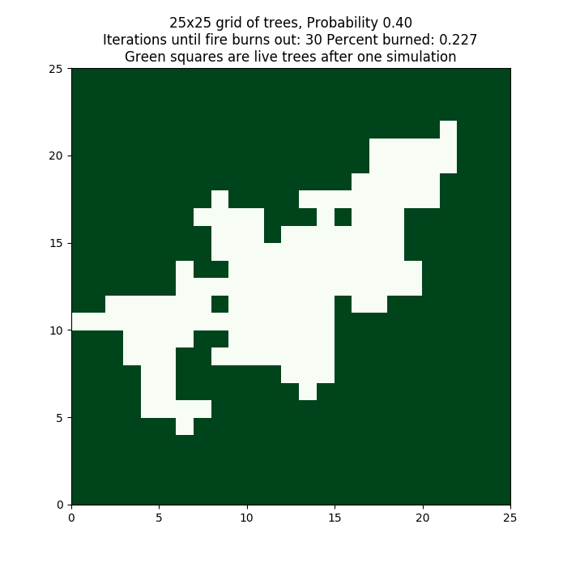
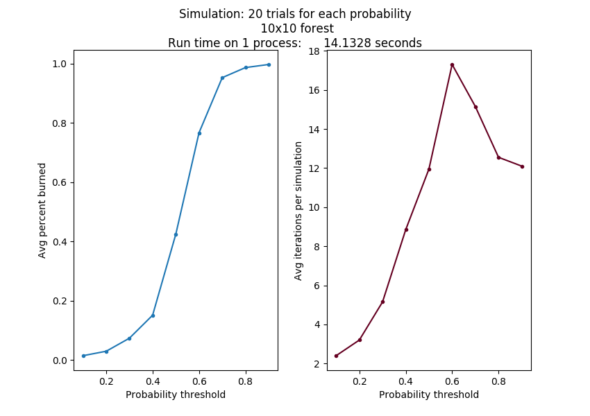
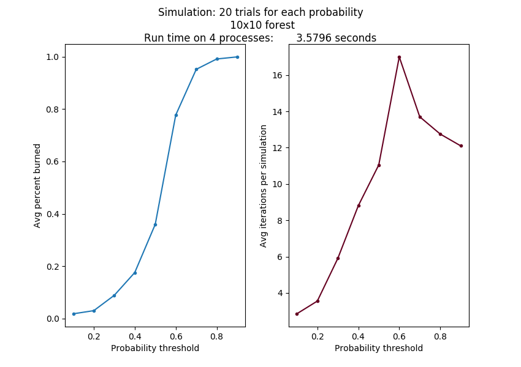

# Forest Fire Simulation Example

Ported to python by Libby Shoop (Macalester College), from the original [Shodor foundation C code example](https://www.shodor.org/refdesk/Resources/Tutorials/BasicMPI/) .

According to the above Shodor page:

"you can run a single instance of a forest fire simulation in which a forest is modeled as an NxN grid of trees. One tree starts to smolder, and each iteration nearby trees have some chance of catching fire. The model follows the following rules:"

- Burning trees burn down.
- Smoldering trees catch fire.
- Unburnt trees next to (N, S, E, W) a burning tree catch fire with some random probability less than or equal to a given probability threshold.
- Repeat until fire burns out.

The main input parameters for the model are:

- The size, N of one row of trees in the NxN grid representing part of the forest.
- The upper limit of the chance of the fire spreading from a burning tree to a nearby unburnt tree.

The simulation starts with the tree in the center of the grid smoldering, and all other trees alive.

The main outputs for the single fire model are:

- The percentage of additional trees burned beyond the first tree.
- The number of iterations before the fire burns out.

One single instance of this model can produce a different result each time it is run because of the randomness of the probability of unburnt trees catching fire. The code in `fire_sequential_once.py` creates a visualization of the run that looks like the following, with N = 25 and the probability threshold = 0.4.



Output like this can be obtained by running the single model like this:

```sh
    python fire_sequential_once.py 25 0.4
```

Try running this several times at the same 0.4 threshold. Then try varying the threshold from 0.2 to 1.0 by 0.1 increments.

Each time the code is run, the result could be different.  In addition, even if we ran several trials, the resulting percent of trees burned and number of iterations before the fire burned out on average would be different, depending on the input probability threshold.  Because of this, a more realistic simulation requires that many instances of the above single simulation be run in this way:

- Keep the size of the grid of trees the same.
- Start with a low probability threshold.
- Run a given number of trials at a fixed probability threshold.
- Repeat for another probability threshold, some increment larger than the previous one, until the threshold is 1.0.

This simulation of multiple trials at a range of different probability thresholds has a known interesting output, which can be graphed as follows:



In this case, we ran 20 trials on a single Raspberry Pi 3B, with the probability threshold starting at 0.1 and incrementing by 0.1. We did this running the code file `fire_sequential_simulate.py` on a cluster head node like this:

```sh
    python fire_sequential_simulate.py 10 0.1 20
```

As the size of the grid changes and the probability points increase, this curve will look roughly the same, although it should get smoother as the number of trials increases and the increment value is smaller. But these more accurate simulations take a long time to run.

## The parallel MPI version

The desired outcome of the parallel version is to also produce a plot of average percent burns as a function of probability of spreading, as quickly and as accurately as possible. This should take into account that the probability of the fire spreading will affect not only how long it takes for the fire to burn out but also the number of iterations required to reached an accurate representation of the average.

If we put more processes to work on the problem, we should be able to complete a more accurate simulation in less time than the sequential version. Even the same problem as above produced the same results running on 4 processes on different nodes of a cluster in almost 1/4 of the time. Its output looks like this:



This can be run like this:

```sh
    mpirun -np 4 -hostfile cluster_nodes --map-by node python fire_mpi_simulate.py 10 0.1 20
```

The parallelization happens by splitting up the number of trials to be run among the processes. Each process completes the range of probabilities for its portion of the trials, sending the results back to the master process.

### Try some other cases to observe how it scales


Ideally, as you double the number of workers on the same problem, the time should be cut in half. This is called **strong scalability**. But there is some overhead from the message passing, so we don't often see perfect strong scalability.

Try running these tests:

<style type="text/css">
.tg  {border-collapse:collapse;border-spacing:0;}
.tg td{font-family:Arial, sans-serif;font-size:14px;padding:10px 5px;border-style:solid;border-width:1px;overflow:hidden;word-break:normal;border-color:black;}
.tg th{font-family:Arial, sans-serif;font-size:14px;font-weight:normal;padding:10px 5px;border-style:solid;border-width:1px;overflow:hidden;word-break:normal;border-color:black;}
.tg .tg-0pky{border-color:inherit;text-align:left;vertical-align:top}
</style>
<table class="tg">
  <tr>
    <th class="tg-0pky">-np</th>
    <th class="tg-0pky">tree row size</th>
    <th class="tg-0pky">probability increment</th>
    <th class="tg-0pky">number of trials</th>
    <th class="tg-0pky">running time</th>
  </tr>
  <tr>
    <td class="tg-0pky">4</td>
    <td class="tg-0pky">20</td>
    <td class="tg-0pky">0.1</td>
    <td class="tg-0pky">40</td>
    <td class="tg-0pky"></td>
  </tr>
  <tr>
    <td class="tg-0pky">8</td>
    <td class="tg-0pky">20</td>
    <td class="tg-0pky">0.1</td>
    <td class="tg-0pky">40</td>
    <td class="tg-0pky"></td>
  </tr>
  <tr>
    <td class="tg-0pky">16</td>
    <td class="tg-0pky">20</td>
    <td class="tg-0pky">0.1</td>
    <td class="tg-0pky">40</td>
    <td class="tg-0pky"></td>
  </tr>
</table>

What do you observe about the time as you double the number of workers?

When does the message passing cause the most overhead, which adds to the running time?


Try some other cases of your own design.
